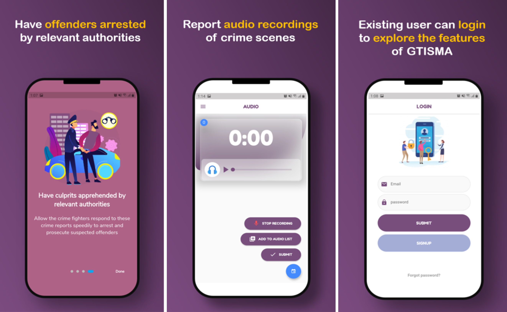

# **Gtisma Mobile Application**

Built with the flutter framwork, GTISMA-mobile app has been built to ease crime reporting and investigation on the fly. 
It faciltates crime reports gathering, validation and evaluation. 
It also serves as an interface between security personnnel and the general public. 
Thus, effectively enhancing policing and crime detection.The web platform for managing crime reports is located at https://www.geotiscm.org while the mobile app is hosted at https://play.google.com/store/apps/details?id=org.security.gtisma

<!-- PROJECT LOGO --> 
 

  

<!-- Screenshots -->
## **App Screenshots**

 

[embed] https://firebasestorage.googleapis.com/v0/b/poster-f8926.appspot.com/o/138-Article%20Text-547-1-10-20221209.pdf?alt=media&token=aca10299-3c7a-4f58-96eb-eaf5eb519828 [/embed]

